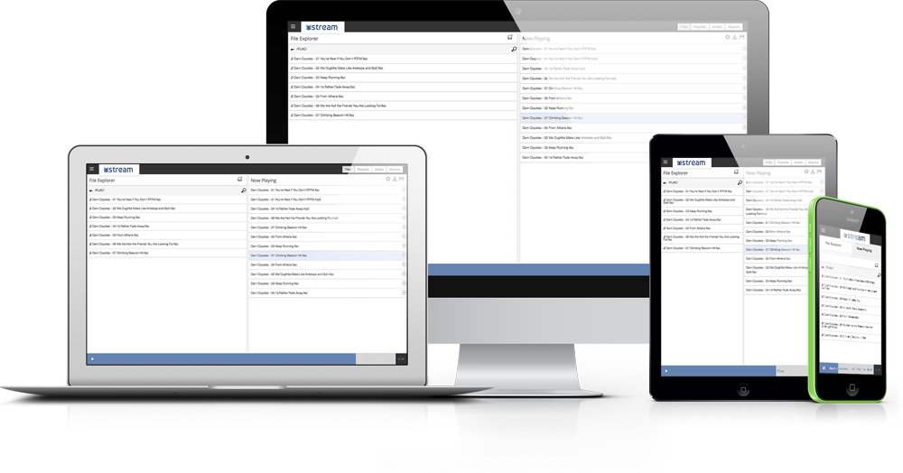
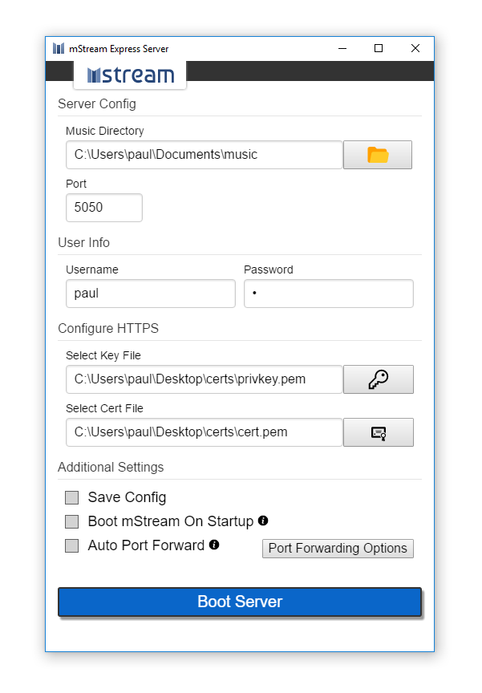

## mStream

mStream is a personal music streaming server written in NodeJS.  mStream comes with a RESTful JSON API and a built in web client to access your music on any browser.

### Main Features

* Works on Mac, Linux and Windows
* Jukebox Mode.  Control your browser with any device
* Secure login system
* Comes with SQLite built in.  No need to setup an external DB
* Server uses a RESTful JSON API.  [It's documented and easy to write code against](docs/API.md)

### Links

* [Check Out The Official Website](http://mstream.io/)
* [Read The Docs](docs/)
* [See The Demo](http://darncoyotes.mstream.io/)

## mStream Express - v0.4

### For Windows & Mac

mStream Express is a port of mStream Server that uses [Electron](https://electron.atom.io/).  It packages all the dependencies for mStream in the app, so you can just download and run.  It also adds a GUI layer to make managing your server as simple as possible.  

[mStream Express is so simple you can setup your server in under 30 seconds.  The video uses v0.1 of mStream which had a simpler interface](https://www.youtube.com/watch?v=IzuxYTaixpU)

### [Download it here](http://www.mstream.io/mstream-express)

## Install From Source

[Install instructions are in the docs](docs/cli_arguments.md)
